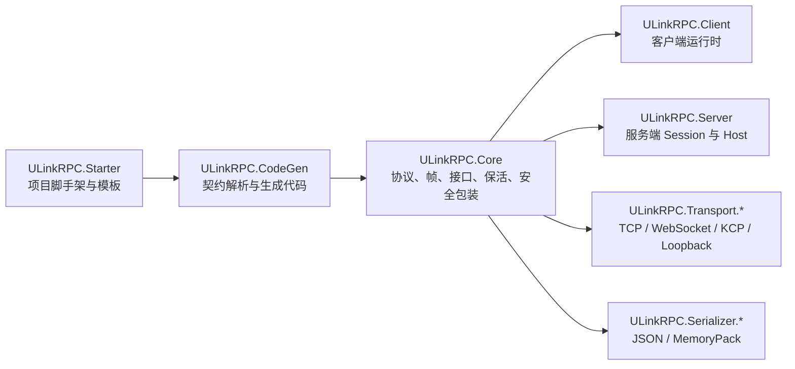

# ULinkRPC src 代码架构审查与开发计划

本文记录对 `src` 下项目代码架构的一次审查结果，并整理后续开发计划。

审查范围包括：

- `ULinkRPC.Core`
- `ULinkRPC.Client`
- `ULinkRPC.Server`
- `ULinkRPC.Transport.*`
- `ULinkRPC.Serializer.*`
- `ULinkRPC.CodeGen`
- `ULinkRPC.Starter`

## 当前架构概览

`src` 下项目的整体分层方向是清楚的：



核心设计可以概括为：

- `Core` 定义协议、帧、RPC envelope、transport 接口、serializer 接口和可选安全包装。
- `Client` 负责发起调用、等待响应、接收 push、keepalive 和断线事件。
- `Server` 负责接收连接、创建 session、分发请求、执行 handler、回包、keepalive。
- Transport 包隐藏 TCP / WebSocket / KCP 的差异，对上暴露完整帧收发。
- Serializer 包只负责对象和 payload 的互转。
- `CodeGen` 从共享契约生成 proxy、binder、facade。
- `Starter` 生成 Shared、Server、Client 项目模板，并调用 codegen。

这个分层总体合理，主要风险集中在版本来源、生命周期状态机、运行时类职责过大、生成代码边界和模板维护成本上。

## 坏味道清单

### 高优先级

#### 1. Starter 包版本常量和真实项目版本漂移

`src/ULinkRPC.Starter/NuGetVersionResolver.cs` 中的 `StarterReleaseVersions` 是手写常量：

- `Core = 0.11.2`
- `Client = 0.11.0`
- `Server = 0.11.7`
- `CodeGen = 0.16.4`

但对应项目文件中的版本已经是：

- `ULinkRPC.Core`：`0.11.3`
- `ULinkRPC.Client`：`0.11.2`
- `ULinkRPC.Server`：`0.11.8`
- `ULinkRPC.CodeGen`：`0.16.5`

影响：

- `ulinkrpc-starter` 生成的新项目可能默认引用旧包。
- 发布流程依赖人工同步，容易漏改。
- 用户遇到运行时、生成器和模板版本不一致时，问题定位困难。

处理方向：

- 建立单一版本来源，例如集中到 `Directory.Build.props`、release manifest 或生成文件。
- 发布前由脚本校验 `StarterReleaseVersions` 和各 csproj 版本一致。
- 增加测试覆盖，直接断言 starter 解析出的版本等于项目元数据或 release manifest。

#### 2. WebSocket acceptor 的 pending slot 生命周期容易重复释放

`WsConnectionAcceptor` 中 pending slot 的所有权跨越了 HTTP handler、channel、`AcceptAsync` 和 `DisposeAsync`：

- `HandleAsync` 中 `TryAcquirePendingSlot()`
- 成功写入 `_connections` 后由 `AcceptAsync` 读取时 `ReleasePendingSlot()`
- dispose drain channel 时也会 `ReleasePendingSlot()`
- handler catch 分支中也可能再次 `ReleasePendingSlot()`

影响：

- slot 计数可能被重复释放，导致 `_pendingAcceptedConnections` 变成负数。
- admission limit 的真实行为会失真。
- 这类 bug 通常只在并发关闭、服务停止、客户端半连接场景中出现。

处理方向：

- 显式建模 slot 所有权，例如 `slotOwnedByHandler` 和 `slotTransferredToQueue`。
- 只有当前 owner 可以释放 slot。
- 增加并发取消、dispose race、channel close 后 handler resume 的测试。

#### 3. `RpcSession` 职责过大

`src/ULinkRPC.Server/RpcSession.cs` 接近 700 行，同时负责：

- session lifecycle
- transport connect / receive loop
- keepalive loop
- request queue 和并发限制
- handler 查找与执行
- scoped service 管理
- response encoding
- send lock
- disconnect reason 和事件
- owned transport dispose

影响：

- 后续修改保活、限流、异常策略、handler 分发时容易互相影响。
- 类内部状态变量多，生命周期状态难以推理。
- Client 和 Server 已经有相似逻辑，继续演进会加重重复。

处理方向：

- 先不做大拆分，先增加关键状态转换测试。
- 再按职责抽出小组件：
  - `SerializedFrameSender`
  - `RpcKeepAliveCoordinator`
  - `ServerRequestDispatcher`
  - `SessionLifecycle`
- 拆分时保持公共 API 稳定，降低对 samples 和 generated code 的影响。

#### 4. Client / Server 运行时生命周期和 keepalive 逻辑重复

`RpcClientRuntime` 和 `RpcSession` 都实现了：

- `StartAsync`
- receive loop
- keepalive loop
- serialized send
- disconnect reason
- dispose / cancellation

影响：

- 同类 bug 需要在两边修。
- Client 和 Server 的行为可能逐渐不一致。
- 保活策略、断线事件语义、send lock 行为缺少共享约束。

处理方向：

- 抽出共享的 internal runtime building blocks。
- 保留 client/server 差异在 dispatch 层，而不是 lifecycle 层。
- 为 disconnect event、keepalive timeout、outgoing traffic 不抑制 timeout 等行为建立共享测试用例。

### 中优先级

#### 5. `ITransport.ConnectAsync` 语义混杂

`ITransport.ConnectAsync` 同时表达：

- 客户端主动连接远端，例如 `TcpTransport`
- 服务端 accepted transport 初始化 stream，例如 `TcpServerTransport`
- no-op，例如 `WsServerTransport`
- 注册 KCP update scheduler，例如 `KcpServerTransport`

影响：

- 接口语义不纯，调用方很难知道 `ConnectAsync` 到底是拨号、初始化还是 no-op。
- `RpcSession.StartAsync` 被迫对 accepted transport 调用 `ConnectAsync`。
- 新 transport 实现时容易复制这种模糊语义。

处理方向：

- 中期考虑拆分 `IClientTransport` 和 `IAcceptedTransport`。
- 如果暂不拆接口，至少在文档和 XML 注释中明确 accepted transport 的 `ConnectAsync` 语义。
- 新增 transport contract tests，约束 `ConnectAsync` 的幂等性、失败状态和 dispose 行为。

#### 6. 安全层配置 API 不对称

Server builder 有 `UseSecurity`，但 client 侧 `RpcClientOptions` 只接收 `ITransport` 和 `IRpcSerializer`。客户端必须手动包一层 `TransformingTransport`。

影响：

- 用户容易只在 server 侧开启安全层，client 侧忘记包装。
- Starter 和生成 facade 很难表达一组对称配置。
- 压缩、加密属于协议级能力，不应该只在 server builder 上有明显入口。

处理方向：

- 给 `RpcClientOptions` 增加可选 `TransportSecurityConfig`。
- 由 `RpcClientRuntime` 或 generated `RpcClient` 统一包装 `TransformingTransport`。
- Starter 生成模板时提供对称配置示例。

#### 7. CodeGen 把用户生成类型写进运行时包命名空间

`FacadeEmitter` 会生成：

```csharp
namespace ULinkRPC.Client
{
    public sealed class RpcClient : IAsyncDisposable
    {
        ...
    }
}
```

影响：

- 用户项目中的生成代码占用了运行时库命名空间。
- 如果运行时包未来提供正式 `ULinkRPC.Client.RpcClient`，会和生成代码冲突。
- IDE 导航和 API 所属边界不清楚。

处理方向：

- 将 generated facade 放到用户指定 namespace，例如 `Rpc.Generated.RpcClient`。
- 或由 runtime 包提供稳定 `RpcClient`，codegen 只生成 service-specific extension/binder。
- 如果短期不能改，至少把该行为记录为兼容性约束。

#### 8. 协议限制常量分散

`64 * 1024 * 1024` 这类最大帧 / 最大 payload 限制分散在：

- `RpcEnvelopeCodec`
- TCP transport
- KCP transport
- KCP server transport
- security decompression config

影响：

- 修改最大帧限制时容易漏改。
- transport frame limit、RPC payload limit、decompressed frame limit 的关系不直观。
- 用户未来需要配置限制时缺少统一入口。

处理方向：

- 引入 `RpcProtocolLimits` 或 `TransportFrameLimits`。
- 默认值集中定义在 `Core`。
- transport 和 codec 从统一配置读取或引用同一常量。

### 低优先级

#### 9. Starter 模板是大量内联字符串和 Unity YAML

`StarterTemplateGenerator.Unity.cs` 同时包含：

- Unity manifest
- packages.config
- NuGet.config
- README
- C# tester script
- Unity scene YAML
- editor script
- embedded NuGetForUnity 资源名

影响：

- 文件过长，review 成本高。
- Unity scene YAML 修改难以辨别真实意图。
- 模板内容和生成逻辑耦合，后续支持更多引擎或更多场景会继续膨胀。

处理方向：

- 把大模板拆成嵌入式模板文件。
- C# 中只保留变量模型和替换逻辑。
- 对模板输出做 golden file 测试。

#### 10. `ProcessRunner` 缺少异步输出读取、超时和取消

`ProcessRunner` 同步读取 stdout，再读取 stderr，最后 `WaitForExit()`。

影响：

- 子进程 stderr 输出较多时可能阻塞。
- starter 执行 `dotnet` / `git` 时没有超时和取消能力。
- 错误输出在长命令场景中不够可控。

处理方向：

- 改成 `WaitForExitAsync`。
- 并行读取 stdout/stderr。
- 支持 timeout 和 cancellation token。

#### 11. 本地 `src` 树中存在 `bin/obj` 构建产物

虽然 `.gitignore` 已经覆盖，且这些产物未被 git 跟踪，但本地 `src` 目录下仍有大量 `bin/obj`。

影响：

- 干扰代码搜索和审查。
- 容易让工具误判源码体积。
- 对新人理解项目结构不友好。

处理方向：

- 清理本地构建产物。
- 在常用脚本中提供 clean 命令。
- 审查、统计、扫描脚本默认排除 `bin/obj`。

## 开发计划

开发顺序固定为：

1. Phase 0：立即修正和防回归。
2. Phase 1：运行时生命周期收敛。
3. Phase 2：协议和配置边界整理。
4. Phase 3：CodeGen 和 Starter 可维护性。

前两项直接影响用户生成项目和并发稳定性，必须先完成；运行时重构依赖测试补强，排在其后；CodeGen namespace 和模板拆分涉及兼容迁移，放在行为稳定后执行。

### 已完成

1. 完成 `src` 架构审查，覆盖 Core、Client、Server、Transport、Serializer、CodeGen、Starter。
2. 将维护者报告落到仓库根目录 `ARCHITECTURE_REVIEW_AND_DEVELOPMENT_PLAN.md`。
3. 从 `CONTRIBUTING.md` 链接维护者报告。
4. 从用户文档站点入口移除该报告。
5. 修复 `StarterReleaseVersions` 与 csproj 版本漂移。
6. 增加 starter 版本一致性测试。
7. 修复 `WsConnectionAcceptor` pending slot 所有权。
8. 增加 WebSocket acceptor queued dispose 回归测试，防止 pending slot 重复释放。
9. 抽出 `SerializedFrameSender`，统一 client/server 发送锁和 `MarkSent` 行为。
10. 抽出 `RpcKeepAliveCoordinator`，让 client/server 复用 keepalive ping/timeout 判断逻辑。
11. 增加 WebSocket acceptor cancellation / dispose race 扩展测试。
12. 清理本地 `src/**/bin` 和 `src/**/obj` 构建产物。
13. 增加 client/server disconnect reason、keepalive timeout、send failure、dispose during receive 行为测试。
14. 将 `RpcSession.ProcessRequestAsync` 中的 handler dispatch 拆成 `ServerRequestDispatcher`。
15. 引入 `RpcProtocolLimits`，集中默认最大 RPC payload、transport frame 和安全解压限制。
16. 补充 `ITransport.ConnectAsync` accepted transport / client transport / no-op 语义注释和 contract tests。
17. 评估 `IClientTransport` / `IAcceptedTransport` 拆分兼容性，本阶段保持 `ITransport` 稳定，先通过文档和测试收紧语义。
18. 给 `RpcClientOptions` 增加 client 侧 `UseSecurity` / `Security` 配置入口，并让 generated facade 通过 `RpcClientRuntime(RpcClientOptions)` 统一应用。
19. 更新 Unity / Godot starter 模板，展示 client/server 两侧一致的安全层配置入口。
20. 调整 generated facade namespace，默认将 `RpcClient` / `RpcCallbackBindings` 放入用户指定 generated namespace，并用 `ULINKRPC_GENERATE_LEGACY_CLIENT_FACADE` 提供旧 namespace 迁移 wrapper。
21. 将部分 Unity / Godot 稳定模板拆成嵌入式模板资源，并新增 Godot starter golden file 测试。
22. 改造 `ProcessRunner`，并行读取 stdout/stderr，支持异步等待、超时和取消。

### 待办

#### Phase 0：立即修正和防回归

目标：处理会直接影响用户生成项目或并发稳定性的风险。

待办：

无，已完成。

验收标准：

- `ulinkrpc-starter new` 生成项目引用的 ULinkRPC 包版本与当前发布目标一致。
- WebSocket acceptor 在并发关闭场景下 pending counter 不会负数或突破上限。
- `dotnet test` 通过。

#### Phase 1：运行时生命周期收敛

目标：降低 `RpcSession` 和 `RpcClientRuntime` 的复杂度，抽出低风险共享组件。

待办：

无，已完成。

验收标准：

- `RpcSession` 明显缩小，生命周期、分发、保活边界清晰。
- Client 和 Server 的 keepalive 行为由同一核心逻辑驱动。
- 公共 API 不发生破坏性变化。

#### Phase 2：协议和配置边界整理

目标：让协议能力和配置入口更一致，减少用户误用。

待办：

无，已完成。

验收标准：

- 最大 payload / frame / decompressed frame 的默认值来源清晰。
- 安全层配置在 client/server 两侧都能通过一等 API 表达。
- 旧用户仍可手动使用 `TransformingTransport`。

#### Phase 3：CodeGen 和 Starter 可维护性

目标：降低生成器和脚手架的长期维护成本。

待办：

无，已完成。

验收标准：

- 生成代码边界更接近用户项目命名空间。
- Starter 模板修改可以通过文件 diff 清楚 review。
- 子进程执行异常时有稳定、完整、不会阻塞的错误报告。
