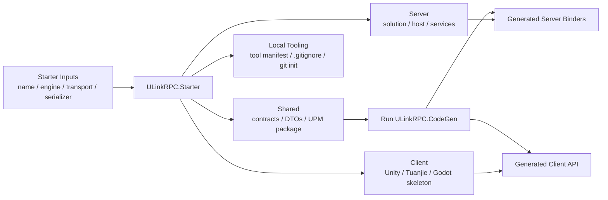

# ULinkRPC.Starter

Scaffold a runnable ULinkRPC template with fixed project folders:

- `Shared` (netstandard2.1 + net10.0)
- `Server` (.NET 10)
- `Client` (Unity 2022 LTS, Unity CN, Tuanjie, or Godot 4.6 C# skeleton)

The tool asks for transport and serializer before generating files.

## Install

Requires .NET SDK 10.0 or later. If you only have .NET 8 or .NET 9 installed, upgrade the SDK before running `dotnet tool install`.

```bash
dotnet tool install -g ULinkRPC.Starter
```

## Usage

```bash
ulinkrpc-starter [--name MyGame] [--output ./out] [--client-engine unity|unity-cn|tuanjie|godot] [--transport tcp|websocket|kcp] [--serializer json|memorypack] [--nugetforunity-source embedded|openupm]
```

Options:

- `--name` Project root folder name. Default is `ULinkApp`.
- `--output` Parent directory for the generated project. Default is the current working directory.
- `--client-engine` Client engine to scaffold: `unity`, `unity-cn`, `tuanjie`, `godot`.
- `--transport` Transport package to use: `tcp`, `websocket`, `kcp`.
- `--serializer` Serializer package to use: `json`, `memorypack`.
- `--nugetforunity-source` For Unity-compatible clients only: `embedded` or `openupm`. This overrides the client engine default.

Default `NuGetForUnity` source by client engine:

- `unity` -> `openupm`
- `unity-cn` -> `embedded`
- `tuanjie` -> `embedded`

If `--client-engine`, `--transport`, or `--serializer` is omitted, the tool enters interactive mode and asks you to choose them in the terminal.

## Examples

Create a project in the current directory and choose transport/serializer interactively:

```bash
ulinkrpc-starter --name MyGame
```

Create a project non-interactively:

```bash
ulinkrpc-starter --name MyGame --output ./samples --transport kcp --serializer memorypack
```

This generates:

```text
samples/
  MyGame/
    .gitignore
    codegen.ps1
    codegen.sh
    Shared/
    Server/
      Server.sln or Server.slnx
      Server/
        Server.csproj
    Client/
```

## What Gets Generated



- `Shared/`: shared DTO project for .NET and a local Unity UPM package. The `.csproj`, `.asmdef`, and `package.json` are generated at the same level, `Directory.Build.props` redirects `obj/bin` to `../_artifacts/Shared/`, and the generated `.csproj` uses `LangVersion=latest` so MemoryPack source generation can compile.
- `Server/Server.sln` or `Server/Server.slnx`: solution file that references `../Shared/Shared.csproj` and `Server/Server.csproj`.
- `Server/Server/`: .NET 10 console app with `ULinkRPC.Server` plus the selected transport and serializer packages. The generated entry uses `RpcServerHostBuilder.Create().UseCommandLine(args)` and wires the selected serializer and acceptor explicitly.
- `Client/`: Unity 2022 LTS / Unity CN / Tuanjie-compatible skeleton with `packages.config`, a local reference to `Shared`, and either an OpenUPM or embedded `NuGetForUnity` setup depending on the selected client engine, or a Godot 4.6 C# skeleton with `project.godot`, `Client.csproj`, and a runnable test node.
- `codegen.ps1` / `codegen.sh`: rerun `ULinkRPC.CodeGen` for both `Server` and `Client` after you change DTOs or service contracts under `Shared/`.
- `.gitignore`: ignore rules for .NET build outputs, editor files, Unity/Godot generated folders, and NuGetForUnity restored packages.

The tool uses a bundled, release-tested package manifest for:

- `ULinkRPC.Core`
- `ULinkRPC.Server`
- `ULinkRPC.Client`
- the selected transport package
- the selected serializer package
- `ULinkRPC.CodeGen`

Default shared DTOs are generated under `Shared/Interfaces/`.
Starter also generates a minimal `IPingService` contract plus `Server/Server/PingService.cs`, installs a local `ULinkRPC.CodeGen` tool manifest, runs code generation for both server and the selected client engine automatically, and writes root `codegen.ps1` / `codegen.sh` helpers so you can regenerate both sides later with one command.
When `memorypack` is selected, the generated `Shared.csproj` uses `LangVersion=latest` so `MemoryPack.Generator` output can compile.
Shared generation disables implicit usings to avoid C# 10 `global using` files in generated build artifacts.
Generated namespaces do not include the user-provided project name. Shared code uses the `Shared...` namespace prefix, and server code uses the `Server...` namespace prefix.
In Unity projects, `Client/Assets/packages.config` writes the user-selected transport and serializer packages with `manuallyInstalled="true"`.
Project generation also runs `git init` at the project root. By default, `unity` uses OpenUPM for `NuGetForUnity`, while `unity-cn` and `tuanjie` embed `NuGetForUnity` locally under `Client/Packages/com.github-glitchenzo.nugetforunity` so the first project open does not depend on `package.openupm.com`. You can always override that default with `--nugetforunity-source`.

## Architecture Notes

Unity intentionally keeps `Shared` as a source-linked local UPM package instead of switching to a prebuilt `Shared.dll` workflow.

This is a deliberate architecture decision:

- Server and Godot stay on the normal `.csproj` path.
- Unity keeps the source-linked shared workflow even for `memorypack`.
- We do not currently accept the workflow tradeoff of requiring an explicit rebuild/sync step after every shared change.
- We also want to avoid adding avoidable friction to future Unity hot-update work such as `HybridCLR`.

The long-form decision record is here:

- [`docs/starter-unity-shared-source-link.md`](./docs/starter-unity-shared-source-link.md)

## Next Steps

After generation:

```bash
cd MyGame
dotnet run --project Server/Server/Server.csproj
```

Then open `Client/` with Unity 2022 LTS, Unity CN, Tuanjie, or Godot 4.6, depending on the selected client engine.

After editing DTOs or service contracts under `Shared/`, rerun:

```powershell
./codegen.ps1
```

On macOS / Linux:

```bash
chmod +x ./codegen.sh
./codegen.sh
```
